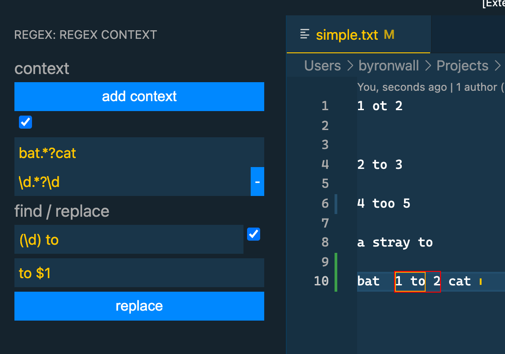
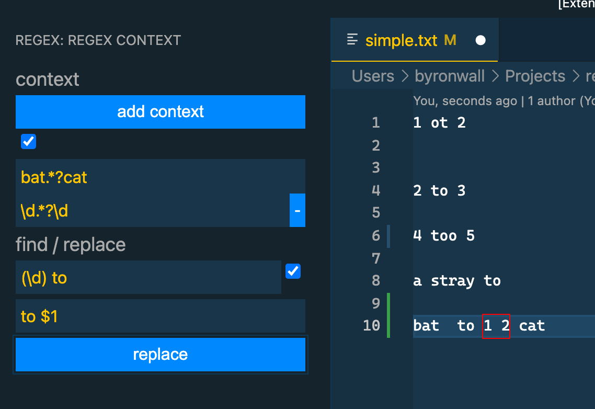

# regex-context README

This extension is meant to provide better control over string processing operations in VS Code. The main focus is to allow for recursive application of regexes to do find/replace operations in open files.

## Features

The core feature is a find/replace mechanism which is first limited by a "context". The context is used to do an initial find. The results of that find are then eligible for the find replace command. The context can be applied recursively to allow for you to iteratively work down to the desired sets of strings to process the find/replace.

It's probably true that a regex guru could replace these nested contexts with simple regexes either via nesting or some lookahead business. I can never figure it out though.

Simple view of a 2-level context (before):

- Red border shows the selection after the final context is applied
- Orange border shows the active find match

Same text after hitting replace

## Known Issues

May not have the correct state on initial load. Likely need a serialization step?

## Release Notes

See CHANGELOG
